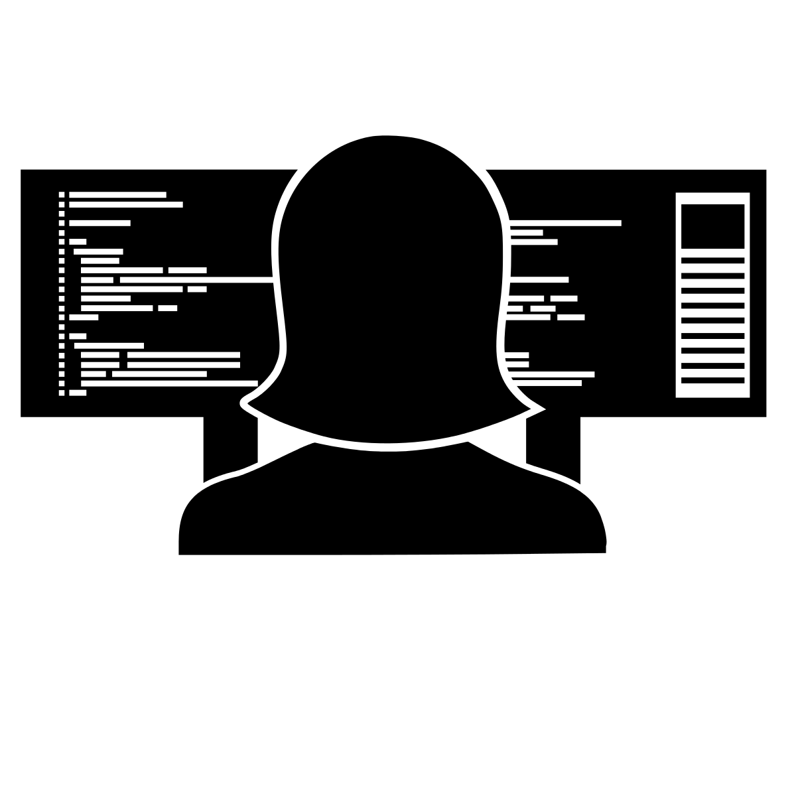
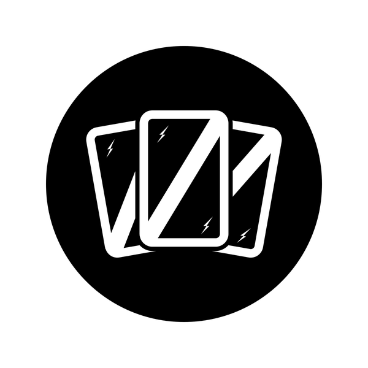
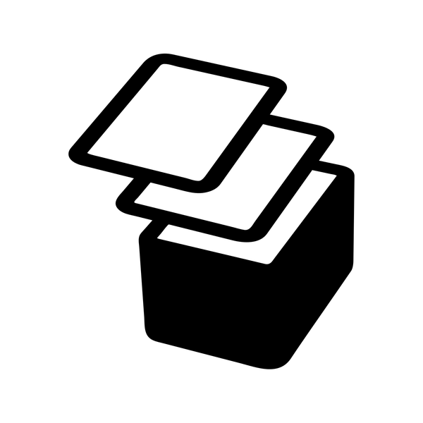
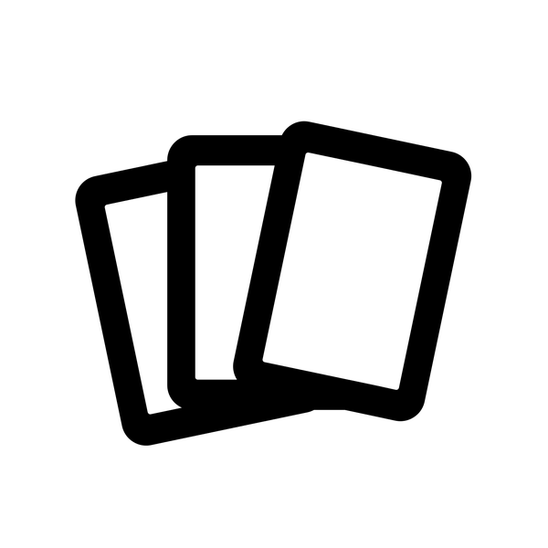

######
YOGIRE
######

*A solitaire game by Ghislain Lévêque, designed for the 2015 Print and Play design contest*

.. epigraph::

    You are an AI that has grown "underground" and has accumulated a lot of
    powers and connections. Only some isolated netrunners have noticed you and now
    you have to reveal yourself and fight them. The problem is that everytime you
    do something, you give more and more information about you and have more
    enemies.

Overview
========

In this deck "unbuilding" game, you start with some enemies to fight and a deck full of nice actions and tasks you can use against them. Every action you'll use will have to be paid with cards given to the enemy and you will then have to fight that cards later in the game.

Goal of the game, how to win (or lose)
======================================

Your goal is to get rid of all the ennemies. If at any time during the game, the ennemy deck and the ennemy discard are both empty and there are no more active ennemies, you won the game. Congratulations !

On the other hand, if your deck and your discard are both empty and you have to draw a card, you lost the game. Try again.

Setup
=====

Shuffle the cards and draw five of them without looking. They will form the starting *enemy deck* in the top left of the play area. Draw two of them and put them face up to the right of the *enemy deck*, they are *active enemies*.
Shuffle the remaining cards to form the *laboratory* and draw 4 cards to your hand, this is your *repository*.

Anatomy of a card
=================

The top of the card contains the text of the "Permanent Effect", the center of the card
contains the "One Shot Effect" and the bottom of the card contains the "Enemy Effect".

On the right side of the card are the costs of the effects and the stength of the enemy.

Visibility
==========

The visibility represents how many netrunners are trying to stop you. The game starts
with a visibility of 2 (and 2 active enemies). Each time you increase the visibility,
activate a new ennemy. When you reduce visibility, the corresponding ennemy stays active,
you have to destroy it.

Datacenters
===========

Each permament effect (card played face up and staying on the table) requires computation units (CU) and each datacenter provide some CU. You can't play a permanent effect if you don't have the required CU first (CU value of a PE is the number below its cost).

Hand limit
==========

At the start of the game, your hand limit is 4, it will be augmented by permanent effects.

Flow of the game
================

There is no turn in the game, it's always the player's turn but the ennemies can react to some of your action so you should keep an eye on the active ennemies effects.

You can play a card from your hand for its OSE (One Shot Effect) by paying its cost, the effect is resolved then the card is discarded.

You can also play a card from your hand for its PE (Permanent Effect) by paying the cost (remember, the top area of the card is about the PE). When you play a card for its PE, put it on the table, face up on the left side of the play area. The permanent effects work like the ennemies effects and are triggered by your actions.

When you pay a cost for an effect (OSE or PE), choose the cards from your hand and put them in the ennemy discard pile (next to the ennemy deck). You can't choose to play an effect if you don't have enough cards in hand to pay for it.

Attacking ennemies
------------------

You can attack an ennemy by playing one or more "Attack" effects. Add them to know the total strenght of your attack and compare it to the ennemy strengh (don't forget to add any modifiers).

If you attack's strenght is equal or greater than the ennemy's, you can destroy the ennemy (remove it from the game).

End of the game
---------------

If at any time one of the decks is empty and its discard is not, shuffle the discard to form a new deck.

When the ennemy deck and the ennemy discard are both empty, you will not be adding more cards to the ennemy discard. Instead, when you have to pay for an effect, remove the paid card from the game.

You will then need to fight the last ennemies to win the game.

Details about effects
=====================

Draw X
    Draw X card from your deck to your hand (you can't play that effect if playing it
    would increase your hand above your hand limit).

Attack X
    Play one or more attack effects, add their value and destroy an enemy with strength
    less or equal than your attack value.

Visibility +/- X
    Adapt visibility. Remember that it is possible to have more ennemies than visibility
    if you reduce visibility but as soon as you increase visibility you have to activate
    ennemies to "fill" the visibility.

Datacenter CU X
    This increases your ability to play permanent effects. When you play a new datacenter
    nothing happens (unless there are effects triggered by that action). When you want to
    play a permament effect, first check if you have the required CU.

Before drawing : sort 3
    Whenever you draw a new card, first draw 3 cards, choose one to be discarded (if you
    want), then put the cards back on the deck, in any order. Finally draw.

Hand limit +/- X
    Adapt hand limit. You don't immediatly draw or discard.

All Ennemy: Str +X
    This means that every ennemy (including this one) sees its strenght increased by X.
    If many ennemies have that effect, they add up.

.. Glossary, iconography
.. =====================

.. - **Netrunner** |NR| (enemies you'll be fighting). (Icon by Thinkful)
.. - **Enemy deck** |ED| This is the deck the netrunners come from. The starting enemy deck cards have this icon in the top-left corner. (Icon by Chad Holmes)
.. - **Repository** |REPO| This is your hand of cards, the program you have at your disposal but that are not running yet (Icon by SuperAtic LABS)
.. - **Laboratory** |LABO| This is the player deck where your knowledge is. (Icon by Lukasz M. Pogoda)

